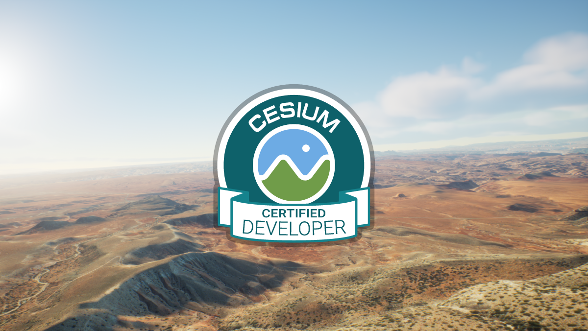

<h1 align='center'> 🌏 <i>Hi! I'm Pavel Nefir</i></h1>

    
    <!--  -->
    

 
 

As a Certified Fullstack Developer, I'm mainly working on the overlapped area of Web and GIS worlds, specially JavaScript frameworks and CesiumJS.  
If you have any unresolved problem in JavaScript frameworks and Cesium community, do not hesitate to contact me.

### **☎️** How to reach me

- Email: pavelnefir85@gmail.com
